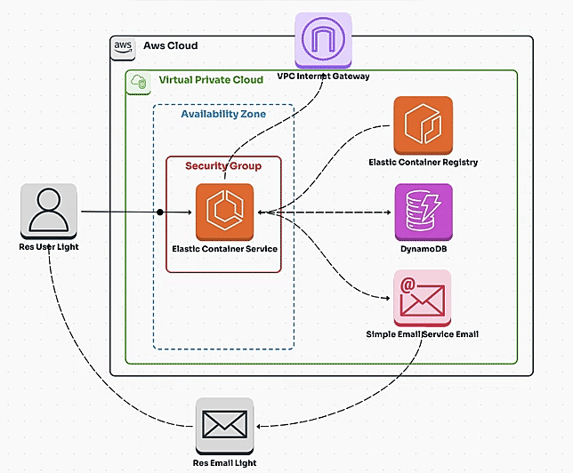

<!DOCTYPE html>
<html lang="en">
<head>
  <meta charset="UTF-8">
  <meta name="viewport" content="width=device-width, initial-scale=1.0">
</head>
<body>
  

    <header>
      <h1>Projeto para site que simula sistema de pedidos 🐶</h1>
      
Este projeto demonstra como criar uma infraestrutura básica na AWS utilizando 
    <strong>Terraform</strong>. Hospedando um site que simula uma página de acoção de cahorros com 
    um formulário.

    </header>
    <section>
      <h2>📋 O que foi feito?</h2>
      <h3>1️⃣ Infraestrutura na AWS com Terraform:</h3>
      <ul>
        <li>Criei toda a infraestrutura utilizando <strong>Terraform</strong>, incluindo:</li>
        <ul>
          <li><strong>VPC (Virtual Private Cloud):</strong> Para isolar e organizar os recursos da aplicação.</li>
          <li><strong>Subnets:</strong> Para separar o tráfego público e privado.</li>
          <li><strong>Route Table e Internet Gateway:</strong> Para gerenciar o tráfego e permitir acesso externo.</li>
          <li><strong>Security Group:</strong> Configurado para permitir o tráfego necessário, garantindo a segurança dos recursos.</li>
          <li><strong>Tabela no Amazon DynamoDB:</strong> Configurada para armazenar os pedidos com os seguintes atributos:</li>
          <ul>
            <li><strong>OrderID:</strong> Identificador único do pedido.</li>
            <li><strong>Puppy:</strong> Nome do pet solicitado.</li>
            <li><strong>Quantity:</strong> Quantidade de pets solicitados.</li>
            <li><strong>Name:</strong> Nome do cliente.</li>
            <li><strong>Email:</strong> E-mail para envio da confirmação.</li>
          </ul>
        </ul>
      </ul>
      <h3>2️⃣ Containerização e Deploy com Amazon ECS:</h3>
      <ul>
        <li>A aplicação foi empacotada em um <strong>container Docker</strong> para garantir portabilidade e consistência.</li>
        <li>Registrei a imagem no <strong>Amazon Elastic Container Registry (ECR)</strong>.</li>
        <pre><code>aws ecr get-login-password --region us-east-1 | docker login --username AWS --password-stdin <strong>(SEU ID DA CONTA AWS)</strong>.dkr.ecr.us-east-1.amazonaws.com
docker tag <strong>(SUA PASTA ONDE ESTÁ O CÓDIGO)</strong>:latest <strong>(SEU ID DA CONTA AWS)</strong>.dkr.ecr.us-east-1.amazonaws.com/<strong>(NOME DO ECR QUE VOCÊ CRIOU)</strong>:latest
docker push <strong>(SEU ID DA CONTA AWS)</strong>.dkr.ecr.us-east-1.amazonaws.com/<strong>(NOME DO ECR QUE VOCÊ CRIOU)</strong></code></pre>
        

        

        <li>Configurei um serviço no <strong>Amazon ECS (Elastic Container Service)</strong> para rodar a aplicação.</li>
        <li>A infraestrutura gerenciada pelo ECS garante alta disponibilidade e escalabilidade.</li>
      </ul>
      <h3>3️⃣ Backend com Python e Flask:</h3>
      <ul>
        <li>Desenvolvi uma aplicação <strong>Flask</strong> que:</li>
        <ul>
          <li>Recebe os dados enviados pelo formulário.</li>
          <li>Armazena os pedidos no <strong>Amazon DynamoDB</strong>.</li>
          <li>Envia e-mails automáticos de confirmação utilizando o <strong>Amazon SES</strong>.</li>
        </ul>
      </ul>
      <h3>4️⃣ Frontend - Página Web (HTML/CSS):</h3>
      <ul>
        <li>Criei uma interface simples que permite ao usuário:</li>
        <ul>
          <li>Inserir informações como nome, e-mail e o pet desejado.</li>
          <li>Submeter os dados que são processados pelo backend.</li>
        </ul>
      </ul>
      <h3>5️⃣ E-mail de Confirmação Automático:</h3>
      <ul>
        <li>Utilizando o <strong>Amazon SES</strong>, configurei o envio de e-mails para notificar os clientes de que seu pedido foi registrado com sucesso.</li>
        <li>O e-mail inclui uma mensagem personalizada, informando que o pet está pronto para ser adotado.</li>
      </ul>
    </section>
    <footer>
      <h2>🚀 Resultado</h2>
      
      

      

      O projeto agora roda em um ambiente gerenciado pelo <strong>Amazon ECS</strong>, com aplicação containerizada garantindo maior portabilidade e escalabilidade.

      

        <strong><a href="https://www.linkedin.com/posts/vinicius-marssoy_aws-cloudcomputing-devops-activity-7267534685252063235-Vf1h?utm_source=share&utm_medium=member_desktop" target="_blank">
        Clique aqui para assistir o vídeo do passo a passo que postei no LinkedIn</a></strong>
      

      
Espero que seja de grande ajuda! 😊

    </footer>
  

</body>
</html>
